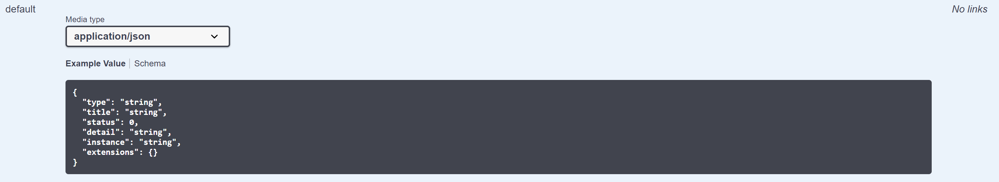

# ReminderApi
Web Api for Web IV 

Angular forend en asp.NET core api backend webapplicatie

Begonnen op 8/3/2020
## 29/03/2020 feedbackmoment
### Overzicht van de requirements : 

Je hoeft normaal niets aan te passen om de api te runnen.
Waarover zou ik graag feedback willen:
- Is mijn domeinlaag in orde ?
- Zijn mijn controllers goed ? 

### Mijn DCD :

### Swagger :

#### Reminders : 
**Get api/reminders**

**Get api/reminders/{id}**

**Post api/reminders**

**Put api/reminders/{id}**

**Delete api/reminders/{id}**

#### Tags
**Get api/tags**

**Get api/tags/{id}**

**Post api/tags**

**Put api/tags/{id}**

**Delete api/tags/{id}**

